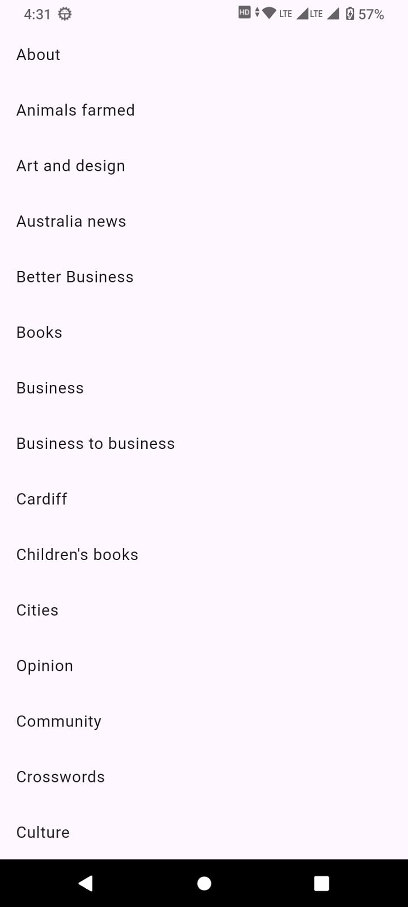

# My News App

A Flutter application designed to demonstrate **API testing** and **WebView integration** using the Guardian News API. This project serves as a practical example of fetching data from a REST API, parsing JSON models, and displaying web content within the app.

## Key Features

- **API Integration**: Connects to the [Guardian Open Platform API](https://open-platform.theguardian.com/) to fetch the latest news sections and articles.
- **Robust Error Handling**: Handles network errors and empty states gracefully, ensuring a smooth user experience.
- **WebView Implementation**: Uses `webview_flutter` to display full article content directly within the application, providing a seamless reading experience without leaving the app.
- **State Management**: efficient `setState` management with proper lifecycle checks (`mounted` checks) to prevent runtime exceptions during async operations.

## Screenshots

| Home Screen | News Screen | Article View |
|:---:|:---:|:---:|
|  |  |  |

## Technology Stack

- **Framework**: Flutter & Dart
- **Networking**: `http` package for API requests.
- **Environment Management**: `flutter_dotenv` for secure API key storage.
- **WebView**: `webview_flutter` for rendering web pages.

## Getting Started

### Prerequisites

- Flutter SDK installed.
- A Guardian API Key (Register at [The Guardian Open Platform](https://open-platform.theguardian.com/access/)).

### Installation

1.  **Clone the repository:**
    ```bash
    git clone https://github.com/milanrnw/Guardian_News_App.git
    cd mynewsapp
    ```

2.  **Install Dependencies:**
    ```bash
    flutter pub get
    ```

3.  **Configure Environment:**
    - Create a `.env` file in the root directory.
    - Add your Guardian API Key:
      ```env
      GUARDIAN_API_KEY=your_api_key_here
      ```

4.  **Run the App:**
    ```bash
    flutter run
    ```

## Project Structure

- `lib/core/`: Contains API request configurations (`api_requests.dart`).
- `lib/models/`: JSON serialization models (`SectionModel`, etc.).
- `lib/presentation/`: UI screens (`HomeScreen`, `NewsScreen`) and `ArticleWebView`.
- `test/`: Unit and widget tests.

## Why this Project?

This project was built to focus specifically on:
1.  **Validating API Responses**: Ensuring data is correctly targeted and parsed.
2.  **Navigation & Lifecycle**: Handling async gaps properly when navigating between screens.
3.  **WebView Integration**: Embedding web content securely and effectively.
